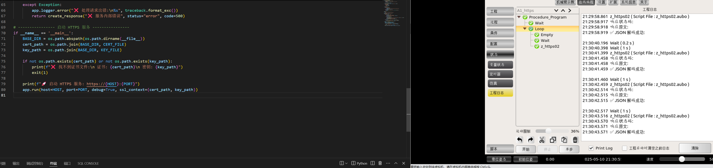

通用要求

前提准备工作要求

    local socket = require("socket")
    local http = require("socket.http")
    local ltn12 = require("ltn12")
    local json = require("dkjson")

---
安装部署环境

    sudo unzip lua_dkjson.zip
    chmod -R 777 /root/aubovisioninstall_2_6_6/usr

    cp -r /root/aubovisioninstall_2_6_6/usr/local/lib/lua /usr/local/lib
    cp -r /root/aubovisioninstall_2_6_6/usr/local/share/lua /usr/local/share
    
注意看目录   
压缩包解压之后，拷贝到指定目录，覆盖
\usr\local

-- 打印 LuaSocket 和 LTN12 的版本信息
print("LuaSocket version: " .. socket._VERSION)
print("LTN12 version: " .. ltn12._VERSION)

---
http://192.168.66.1:8000/api
http://192.168.80.1:8000/api
http://172.16.9.208:8000/api

ipconfig /ip a同网络下所有的都可以监控到状态更新
再然后就是处理json文件和其他相关数据分析了

---

https 部署
Lua 的 socket.http 模块默认不支持 HTTPS
新增文件
ssl.so 是 LuaSec 编译后的 C 扩展模块，并非直接可以下载使用的可移植文件，因为它 依赖你的系统环境（尤其是 OpenSSL、Lua 版本）进行编译。

src/ssl.so（你需要的文件）
src/https.lua（也推荐一起拷贝）
三个文件

scp src/ssl.so user@192.168.X.X:/usr/local/lib/lua/5.1/

scp src/https.lua user@192.168.X.X:/usr/local/share/lua/5.1/ssl/
scp src/ssl.lua user@192.168.X.X:/usr/local/share/lua/5.1/

类似于socket

/usr/local/share/lua/5.1# ls
dkjson.lua  https.lua  ltn12.lua  mime.lua  socket  socket.lua  ssl  ssl.lua
root@swh:/usr/local/share/lua/5.1# ls ssl
ssl/     ssl.lua
root@swh:/usr/local/share/lua/5.1# ls ssl/
https.lua
root@swh:/usr/local/share/lua/5.1# ls socket/
ftp.lua  headers.lua  http.lua  smtp.lua  tp.lua  url.lua

---

/usr/local/lib/lua/5.1# ls socket/
core.so
root@swh:/usr/local/lib/lua/5.1# ls mime/
core.so
root@swh:/usr/local/lib/lua/5.1#

