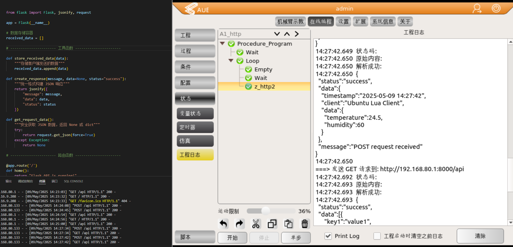
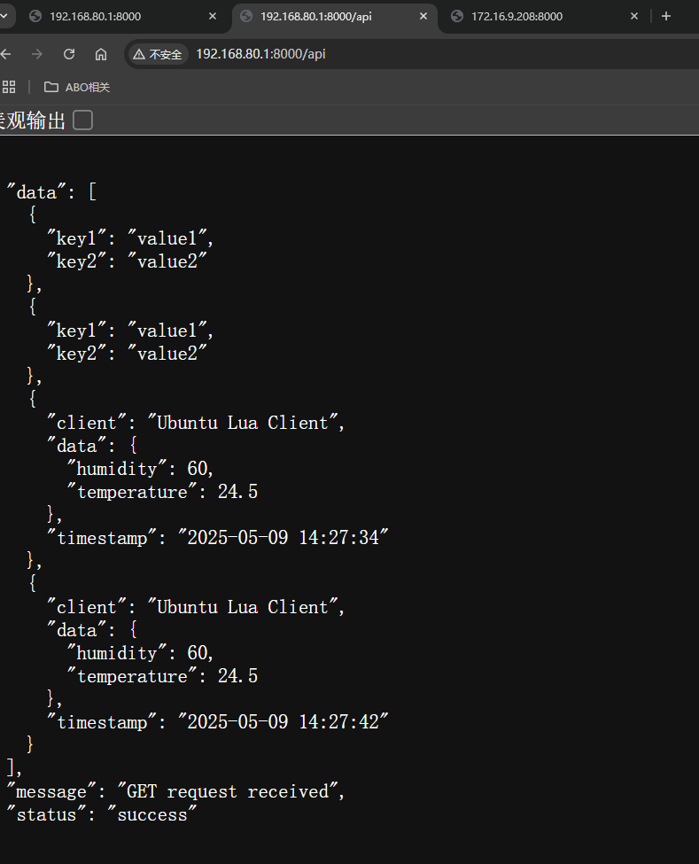

通用要求

前提准备工作要求

    local socket = require("socket")
    local http = require("socket.http")
    local ltn12 = require("ltn12")
    local json = require("dkjson")

---
安装部署环境

    sudo unzip lua_dkjson.zip
    chmod -R 777 /root/aubovisioninstall_2_6_6/usr

    cp -r /root/aubovisioninstall_2_6_6/usr/local/lib/lua /usr/local/lib
    cp -r /root/aubovisioninstall_2_6_6/usr/local/share/lua /usr/local/share
    
注意看目录   
压缩包解压之后，拷贝到指定目录，覆盖
\usr\local

-- 打印 LuaSocket 和 LTN12 的版本信息
print("LuaSocket version: " .. socket._VERSION)
print("LTN12 version: " .. ltn12._VERSION)

---
http://192.168.66.1:8000/api
http://192.168.80.1:8000/api
http://172.16.9.208:8000/api

ipconfig /ip a同网络下所有的都可以监控到状态更新
再然后就是处理json文件和其他相关数据分析了